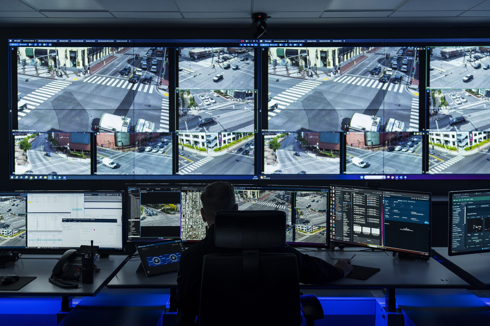
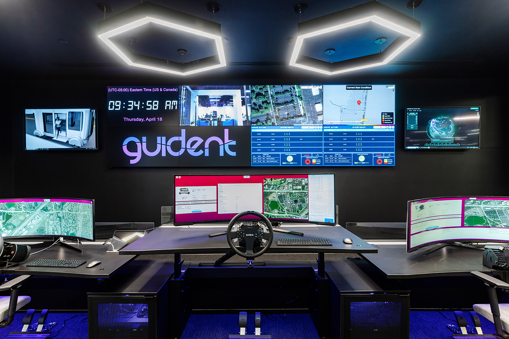
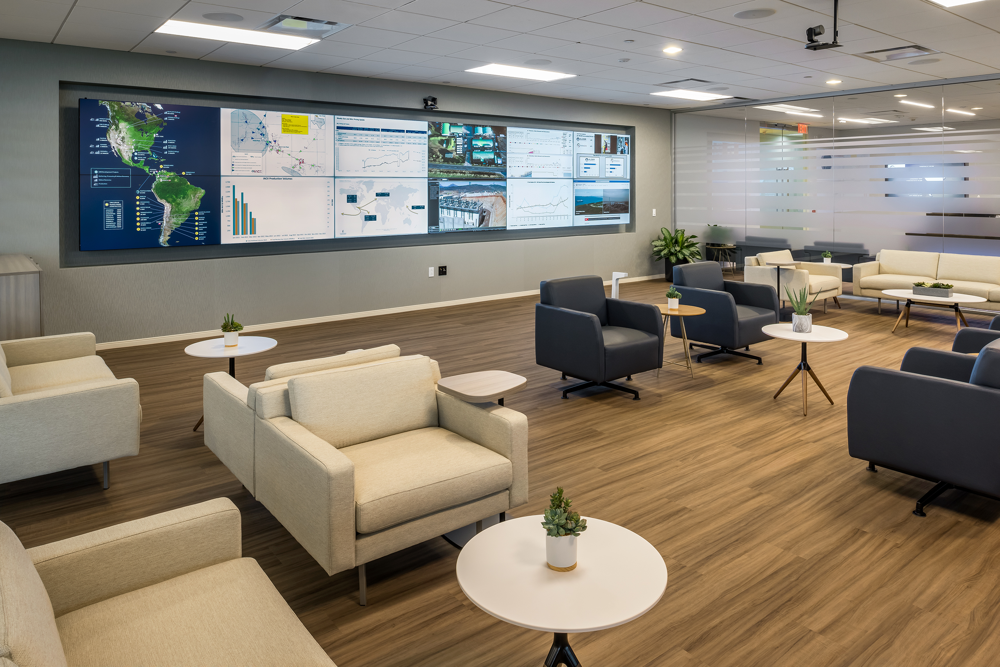
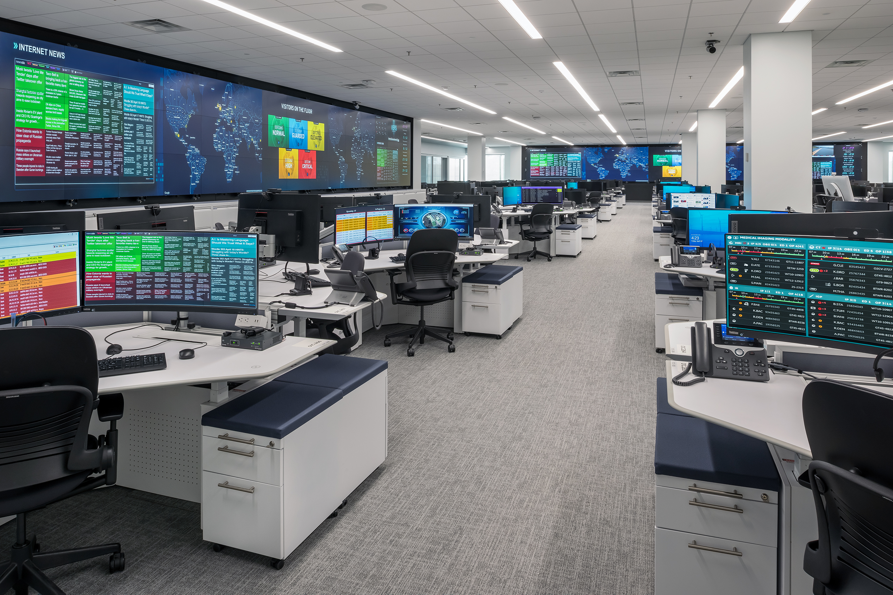

<!-- markdownlint-configure-file { "MD033": false, "MD041": false } -->

<a href="https://constanttech.com/">
<picture>
   <source media="(prefers-color-scheme: dark)" srcset="logo-dark.png" width="600" />
   <source media="(prefers-color-scheme: light)" srcset="logo-light.png" width="600" />
   
</picture>
</a>

<picture>
   <source media="(prefers-color-scheme: dark)" srcset="https://gist.github.com/user-attachments/assets/db4f0404-5cfa-43f6-85d9-a523057aeea6" width="600" />
   <source media="(prefers-color-scheme: light)" srcset="https://gist.github.com/user-attachments/assets/2d6e9cd3-f615-414a-b80d-995d12f3a7fb" width="600" />
   
</picture>

---

|  |  | 
| -- | -- | --
|  |  | 

---

A global leader with over 40 years of expertise, specializes in designing and implementing high-performance Global Security Operations Centers (GSOCs). Serving U.S. Government agencies, public safety organizations, utilities and critical infrastructure operators, as well as commercial enterprises across retail, financial services, and technology sectors, we tailor our solutions to the unique needs of each organization, delivering advanced video wall systems, ergonomic and durable technology furniture, professional installation, and ongoing 24/7 service and support.

Constant understands the critical nature of security operations, and our comprehensive approach ensures that each organization receives customized solutions designed to support its specific mission. Join the ranks of our satisfied clients who trust us to deliver unmatched command and control centers, empowering teams with the tools they need to maintain situational awareness, manage risk, and respond effectively when it matters most.

---
